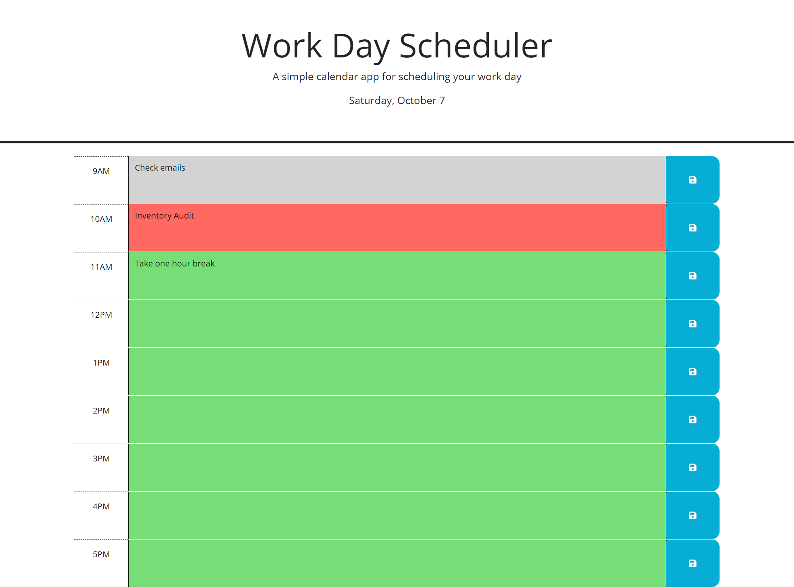

# Project Information

In this challenge, I created a Work Day Scheduler that displays the
current date on the top of the page, saves input/tasks that are given,
and color codes specific hours of the day depending on whether it is 
in the past, present, or future.

## Acceptance Criteria

GIVEN I am using a daily planner to create a schedule
WHEN I open the planner
THEN the current day is displayed at the top of the calendar
WHEN I scroll down
THEN I am presented with timeblocks for standard business hours of 9am&ndash;5pm
WHEN I view the timeblocks for that day
THEN each timeblock is color coded to indicate whether it is in the past, present, or future
WHEN I click into a timeblock
THEN I can enter an event
WHEN I click the save button for that timeblock
THEN the text for that event is saved in local storage
WHEN I refresh the page
THEN the saved events persist

### Live website and repo

https://github.com/TamirP123/work-day-scheduler

https://tamirp123.github.io/work-day-scheduler/

#### Photo of application
